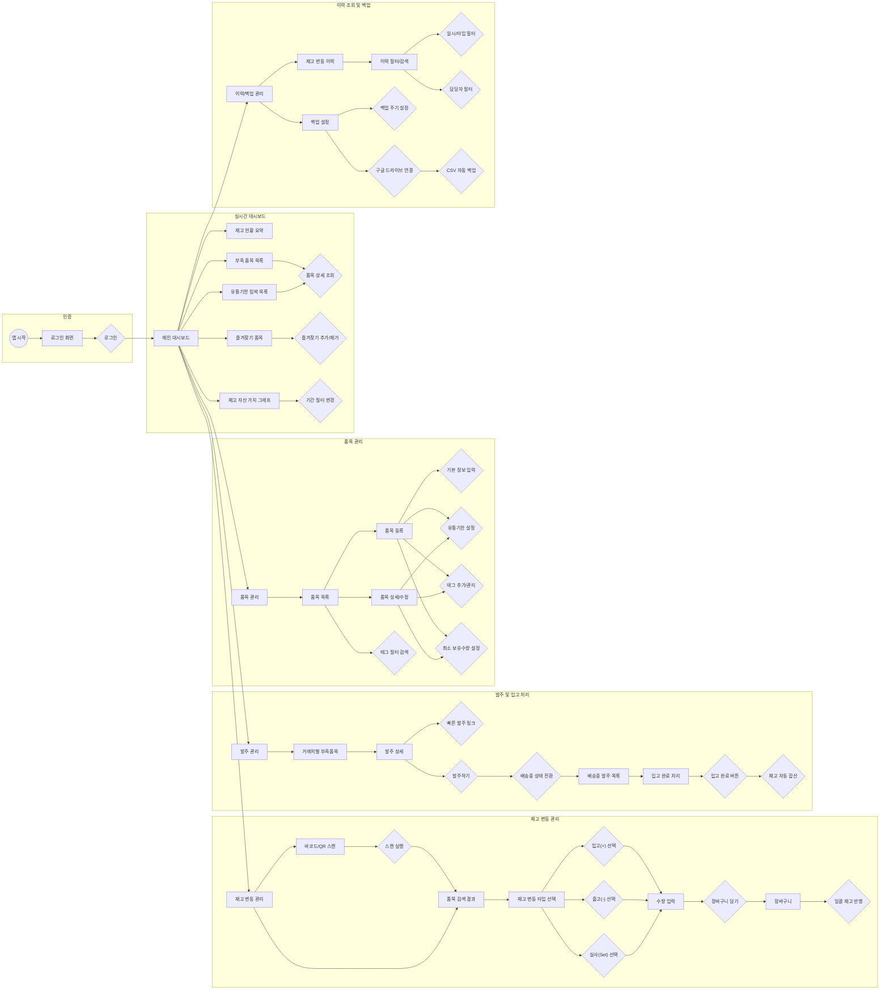

```mermaid
flowchart LR

  subgraph s1 ["인증"]
    n1(("앱 시작"))
    n2["로그인 화면"]
    n3{"로그인"}
  end

  subgraph s2 ["실시간 대시보드"]
    n4["메인 대시보드"]
    n5["재고 현황 요약"]
    n6["부족 품목 목록"]
    n7["유통기한 임박 목록"]
    n8["즐겨찾기 품목"]
    n9["재고 자산 가치 그래프"]
    n10{"품목 상세 조회"}
    n11{"즐겨찾기 추가/제거"}
    n12{"기간 필터 변경"}
  end

  subgraph s3 ["재고 변동 관리"]
    n13["재고 변동 관리"]
    n14["바코드/QR 스캔"]
    n15["품목 검색 결과"]
    n16["재고 변동 타입 선택"]
    n17["수량 입력"]
    n18["장바구니"]
    n19{"스캔 실행"}
    n20{"입고(+) 선택"}
    n21{"출고(-) 선택"}
    n22{"실사(Set) 선택"}
    n23{"장바구니 담기"}
    n24{"일괄 재고 반영"}
  end

  subgraph s4 ["발주 및 입고 처리"]
    n25["발주 관리"]
    n26["거래처별 부족품목"]
    n27["발주 상세"]
    n28["배송중 발주 목록"]
    n29["입고 완료 처리"]
    n30{"빠른 발주 링크"}
    n31{"발주하기"}
    n32{"배송중 상태 전환"}
    n33{"입고 완료 버튼"}
    n34{"재고 자동 합산"}
  end

  subgraph s5 ["품목 관리"]
    n35["품목 관리"]
    n36["품목 목록"]
    n37["품목 등록"]
    n38["품목 상세/수정"]
    n39{"기본 정보 입력"}
    n40{"유통기한 설정"}
    n41{"태그 추가/관리"}
    n42{"최소 보유수량 설정"}
    n43{"태그 필터 검색"}
  end

  subgraph s6 ["이력 조회 및 백업"]
    n44["이력/백업 관리"]
    n45["재고 변동 이력"]
    n46["이력 필터/검색"]
    n47["백업 설정"]
    n48{"일시/타입 필터"}
    n49{"담당자 필터"}
    n50{"백업 주기 설정"}
    n51{"구글 드라이브 연결"}
    n52{"CSV 자동 백업"}
  end

  n1 --> n2
  n2 --> n3
  n3 --> n4
  n4 --> n5
  n4 --> n6
  n4 --> n7
  n4 --> n8
  n4 --> n9
  n6 --> n10
  n7 --> n10
  n8 --> n11
  n9 --> n12
  n4 --> n13
  n13 --> n14
  n14 --> n19
  n19 --> n15
  n13 --> n15
  n15 --> n16
  n16 --> n20
  n16 --> n21
  n16 --> n22
  n20 --> n17
  n21 --> n17
  n22 --> n17
  n17 --> n23
  n23 --> n18
  n18 --> n24
  n4 --> n25
  n25 --> n26
  n26 --> n27
  n27 --> n30
  n27 --> n31
  n31 --> n32
  n32 --> n28
  n28 --> n29
  n29 --> n33
  n33 --> n34
  n4 --> n35
  n35 --> n36
  n36 --> n37
  n36 --> n38
  n37 --> n39
  n37 --> n40
  n37 --> n41
  n37 --> n42
  n38 --> n40
  n38 --> n41
  n38 --> n42
  n36 --> n43
  n4 --> n44
  n44 --> n45
  n45 --> n46
  n46 --> n48
  n46 --> n49
  n44 --> n47
  n47 --> n50
  n47 --> n51
  n51 --> n52
```
